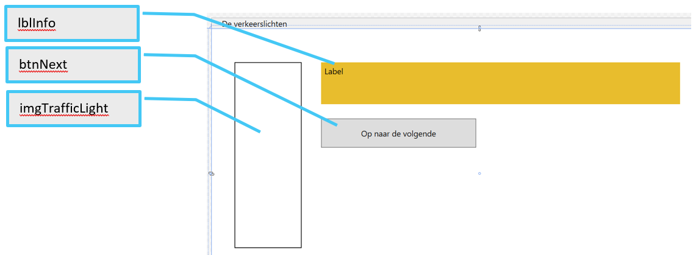
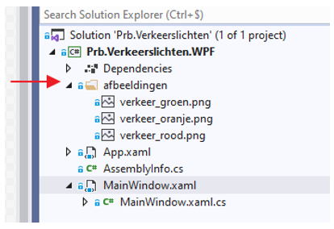
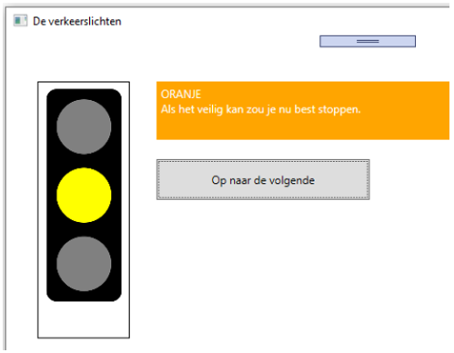
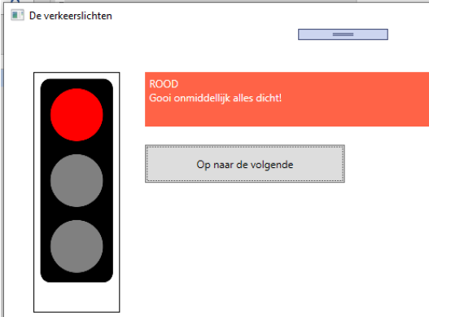
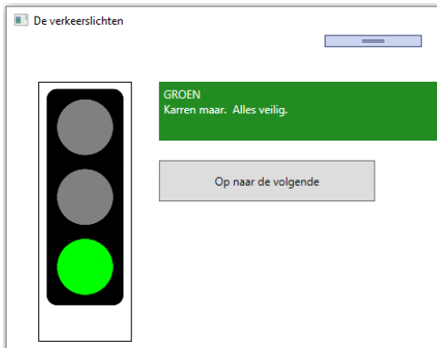

# Oefening 01  
## Selecties  
## Verkeerslichten  

Nadat je de startcode hebt binnengehaald verschijnen volgende controls op je venster :   

Je zal in je solution explorer ook merken dat een map werd opgenomen met de naam “afbeeldingen” waarin zich 3 afbeeldingen bevinden :  
   

De bedoeling van het programma is om random getallen te genereren van 1 t/m3 (dus of 1 of 2 of 3).  
Wanneer het getal = 1, dan moet :     
  * lblInfo in het oranje gekleurd worden  
  * er in lblInfo een aangepaste tekst te verschijnen (zie afbeelding)  
  * in imgTrafficLight de correcte afbeelding te verschijnen  
    

Wanneer het getal = 2, dan moet :  
  * lblInfo in het rood  gekleurd worden  
  * er in lblInfo een aangepaste tekst te verschijnen (zie afbeelding)  
  * in imgTrafficLight de correcte afbeelding te verschijnen  
     

Wanneer het getal = 3, dan moet :   
  * lblInfo in het groen  gekleurd worden  
  * er in lblInfo een aangepaste tekst te verschijnen (zie afbeelding)  
  * in imgTrafficLight de correcte afbeelding te verschijnen  
     

Het random getal genereer je zowel bij het opstarten van het programma als wanneer op btnNext wordt geklikt.  Uiteraard voer je dan alle hierboven beschreven acties uit.  
  
De code om de afbeelding in imgTrafficLight te plaatsen is in je project reeds aanwezig via de methode SetTrafficLigtImagePath.  
Naar deze methode stuur je als string de naam van de afbeelding die dient gebruikt te worden (dus ofwel “verkeer_groen.png”, ofwel “verkeer_oranje.png” ofwel “verkeer_rood.png”).  
De exacte betekenis van deze instructies kom je verderop in je opleiding nog te weten.  Nu dien je alleen deze methode te kunnen toepassen.  
  
    
> **Random getallen**  
> In c# is een random generator aanwezig.  
> Omdat je deze random generator op meerdere plaatsen zal nodig hebben, doe je er goed aan om deze globaal aan te maken.  
> De generator maak je als volgt aan :   
> 
> &nbsp;&nbsp;&nbsp;&nbsp;&nbsp;&nbsp;Random rnd = new Random();  
> 
> waarbij “rnd” nu dus je random generator is.  
> 
> Om deze random generator (rnd dus) te gebruiken, pas je de Next methode toe.  Dit doe je bijvoorbeeld als volgt :  
> 
> &nbsp;&nbsp;&nbsp;&nbsp;&nbsp;&nbsp;int willekeurigGetal = rnd.Next(1,4);  
> 
> In de variabele willekeurigGetal zit nu een willekeurig getal gaande van 1 tot 3 (dus ofwel 1, ofwel 2 ofwel 3).  Hierbij is dus het eerste argument (in dit voorbeeld dus 1) de ondergrens, en is het tweede argument (hier dus  4) de bovengrens + 1 : je dient als tweede argument dus steeds een waarde te kiezen die net één groter is dan de maximale te genereren waarde.  
  
    
    
> **Achtergrondkleur instellen**   
> De achtergrondkleur van lblInfo kan je bijvoorbeeld als volgt in het oranje kleuren :   
>  
> &nbsp;&nbsp;&nbsp;&nbsp;&nbsp;&nbsp;lblInfo.Background = Brushes.Orange;  
>  
> Je gebruikt hier dus de Brushes klasse voor.   
> Wil je ook de voorgrondkleur aanpassen, dan zoek je dat zelf even op internet op.  

